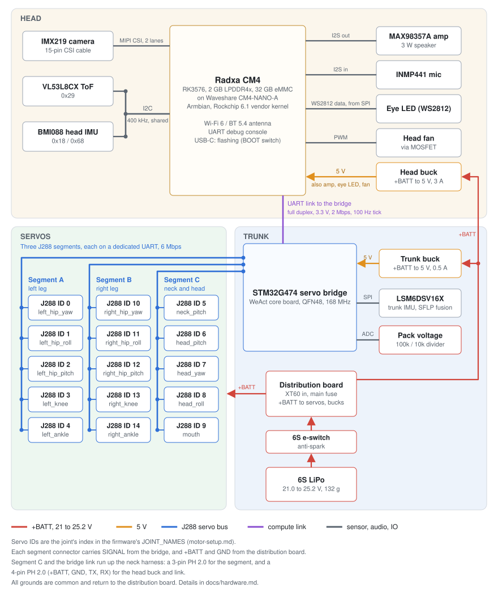

# Dukki

> [!IMPORTANT]
> Everything in here is very much a work in progress!

A rework of the Pollen Robotics [Microduck](https://github.com/pollen-robotics/microduck) with a few hardware changes:

- Radxa CM4 brain (instead of the Radxa Zero 3W)
  - RK3576 vs RK3566: roughly twice the CPU and a 6 TOPS NPU vs 0.8 TOPS
- Unitree J288 servos (instead of the Dynamixel XL330-M288-T)
  - About three times faster: 35 rad/s (25 V), vs about 11 rad/s for the XL330
  - Twice the weight: 39 g vs 18 g
  - Similar stall torque, about 0.45 N·m measured against 0.43 N·m for the XL330 model

## Hardware block diagram

## What's in this repository

This repository holds the Dukki documentation, the hardware design files (KiCad), and the code that doesn't fit neatly into one of the forked repos, such as the STM32 servo bridge firmware, compute module setup scripts and J288 bench test tools. Changes elsewhere live on branches of forked repos: the robot firmware in [microduck](https://github.com/lachlanhurst/microduck/tree/dukki) (`dukki`), RL training in [microduck_rl](https://github.com/lachlanhurst/microduck_rl/tree/dukki-j288) (`dukki-j288`), the J288 actuator model in [bam](https://github.com/lachlanhurst/bam/tree/unitree-j288) (`unitree-j288`) and the head IMU driver in [bmi088-rs](https://github.com/lachlanhurst/bmi088-rs/tree/configurable-addresses) (`configurable-addresses`).

## Docs

[Hardware](docs/hardware.md) is the main design document. It covers each subsystem (servos, compute, the STM32 servo bridge, IMUs, power, audio, camera, ToF) and compares it with the OG robot.

[Compute setup](docs/compute-setup.md) takes a Radxa CM4 from the box to a board on WiFi at `microduck.local`. That includes flashing Armbian to the eMMC.

[Servo setup](docs/motor-setup.md) is the bench procedure for each J288 before assembly. You set the bus ID with Unitree's Windows tool, record the firmware version, run a motion check and label the servo for its joint.

[J288 bench testing](docs/j288-testing.md) has the results from characterising one servo: bus timing, friction, armature, torque limits and heating. The main finding is that peak output torque is about 0.45 N·m, close to the XL330.

[Camera setup](docs/camera-setup.md) and [audio setup](docs/audio-setup.md) bring up the IMX219 camera and the MAX98357A speaker and INMP441 microphone on the CM4.

## Licence

MIT, see [LICENSE](LICENSE). The third-party datasheets and schematics in [docs/datasheets/](docs/datasheets/) belong to their publishers and are not covered by it.
