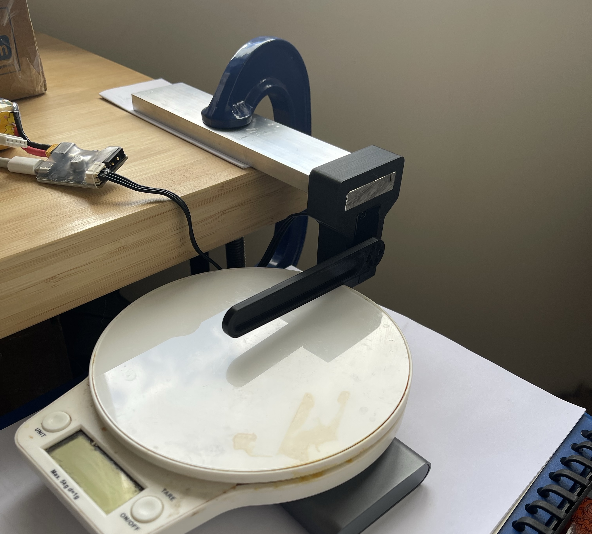

# Microduck Unitree: J288 bench testing

The stall test setup. The J288 sits in a printed bracket on an aluminium bar clamped to the bench, with the 100 mm arm resting on the 5 kg kitchen scale. The same bracket and arm, without the scale, were used for the other tests.

Date: 27/09/2026.

This document records the first bench characterisation of one J288: what was run, the raw results, and what they mean for the servo bridge, the robot's mass budget and the BAM actuator model in `microduck_rl`. The tools are in `scripts/j288/` (see its README for command lines) and the logs are in `scratch/j288_explore/`, which is not committed. Section numbers in `hardware.md` are cited as "hardware.md 5.1" and so on.

## 1. Summary

| Quantity | Result | Section |
|---|---|---|
| Bus round trip, one servo, USB adapter | 0.21 ms median, 0.30 ms worst | 4 |
| Mode 0 (stop) | Windings shorted: viscous brake of 0.148 N·m·s/rad, not free | 5 |
| Reported torque | Motor torque from current, before gearbox losses. Reads within 0.005 N·m of the command | 5, 6 |
| Breakaway torque, unloaded | 0.029 to 0.030 N·m | 6 |
| Friction while moving | About 0.046 N·m (Coulomb term fitted over 0 to 15 rad/s) | 7 |
| Armature (reflected rotor inertia) | 7.8 × 10⁻⁴ kg·m², about 43% of the XL330 model's 1.81 × 10⁻³ | 7 |
| Torque response | Within one 1 ms loop period | 7 |
| Reported speed | First-order filtered inside the servo, time constant about 15 ms. The firmware's kd term uses the filtered speed | 9 |
| Motor torque limit | Hard clamp at 1.00 N·m (reported) | 10 |
| Output torque at stall | 0.48 × motor torque + 0.017 N·m, for 0.2 to 0.9 N·m of motor torque | 10 |
| Peak driving torque at the output | 0.45 to 0.47 N·m, from cold, at the clamp | 10 |
| Winding heating at stall | 0.3 °C/s at 0.3 N·m, 1 °C/s at 0.5, 2 °C/s at 0.7, 3.5 °C/s at 0.9, 4.5 °C/s at the clamp (motor torque) | 10 |
| Compared with the XL330 as simulated | Same peak driving torque (0.425 N·m for the XL330 model) | 11 |

The two findings with the most consequence:

- The J288's peak driving torque at the output is about 0.45 N·m, not the 1.5 N·m on Unitree's page. Unitree's figure is specified with the torque opposing the direction of motion, the back-driven case where gearbox friction helps. It is about the same as the XL330 the shipped policies were trained against, on a robot that gets substantially heavier (section 12).
- The windings heat quickly above about 0.5 N·m of motor torque. For the robot, sustained torque is likely to be the binding limit before peak torque is.

## 2. Setup

- One J288, ID 0 (factory default), in a printed bracket clamped to the bench.
- A 3D-printed arm of 6 g, about 100 mm from the output axis to the tip, on the servo's metal horn. As a uniform rod its inertia about the axis is 2.0 × 10⁻⁵ kg·m²; the horn's contribution is negligible.
- Unitree's USB to single-bus module (Artery AT32 CDC device, `/dev/cu.usbmodem3744CBC819741` on the Mac), powered from a 4S LiPo. The servo read 15.5 to 16.0 V throughout. All results are at 4S; section 14 lists what needs repeating at 6S.
- Test loop at 1 kHz from Python on the Mac, every command and reply logged.
- Stall tests: two kitchen scales under the arm tip, lever 100 mm. The first overloaded at about 560 g. The second is the 5 kg, 1 g resolution scale in the photo.

The torque sign convention: positive torque turns the bench arm counter-clockwise, into the scale.

Limits of the setup, visible in the photo:

- The servo sits in a printed plastic bracket with little heat sinking. The heating rates in section 10 are for that mounting; a servo bolted to metal will settle cooler over minutes.
- The arm meets the scale near the edge of the pan, and its rounded tip makes the exact lever uncertain by a few millimetres. Off-centre loading and lever error both add to the scatter between runs.
- The scale stands on a stack of paper and other objects rather than directly on a rigid surface, which may account for some of the settling seen during holds.

## 3. Tools

`scripts/j288/j288.py` is the serial driver: frame building, Unitree's CRC32, reply parsing and conversion to output-side SI units using the exact gear ratio 70070/243 (288.354). It was checked against Unitree's Python demo (`unitreerobotics/digital_servo`, `python/servo_demo.py`): identical CRCs on 2,000 random frames and identical command frames on 500 random commands. It avoids two bugs in the demo, which packs the position as unsigned (failing on any negative position) and reads the winding temperature and voltage as signed bytes.

`scripts/j288/explore.py` holds the tests: `hand`, `ramp`, `steps`, `position` and `stall`.

## 4. Communication

Probe: 200 stop frames, no motion.

| Measure | Result |
|---|---|
| Valid replies | 200 of 200 on the first CDC port; the second port does not answer |
| Round trip | 0.21 ms median, 0.26 ms 95th percentile, 0.30 ms maximum |
| State at rest | ID 0, mode 0, no faults, housing 31 °C, winding 34 °C, 16.0 V |
| Rotor-derived position against output encoder, at rest | 2.4214 against 2.4245 rad |

At rest the two position readings agree to about four output-encoder counts, which suggests the multi-turn rotor position is seeded from the output encoder at power-up.

Behaviour found along the way:

- Each reply reports the state from before its own command was applied, a one-frame lag. At 1 kHz that is under 1 ms and irrelevant to the model, but it matters when reading logs.
- Timeout latch. With timeout protection enabled, a gap of about 1 s without frames latches the timeout bit and the servo then ignores enable commands. A frame with the timeout bit clear resets it. In one trial the clear showed in the reply to the tenth such frame (2.8 ms); in three later trials, with 0, 5 and 20 ms between frames, it showed in the second. The tools keep sending clearing frames for up to 0.5 s. The bridge firmware needs the same handling after any interruption.

## 5. Operating modes (hand test)

Log: `hand_2026-09-27_12h04m47.json`. The arm was turned by hand in each phase. Reported torque is fitted as a × speed + b × sign(speed) over the samples where the arm moved faster than 0.3 rad/s.

| Phase | How it felt | Hand speeds reached | Reported torque fit |
|---|---|---|---|
| Mode 0 (stop) | Resistance | up to 2.1 rad/s | −0.148 × speed, Coulomb term 0.001 N·m |
| Mode 1, kp = kd = torque = 0 | No resistance | up to 5.2 rad/s | ≈ 0 (0.001 × speed) |
| Mode 1, kd = 0.05 N·m·s/rad | Some resistance | up to 3.2 rad/s | −0.0484 × speed |

What this shows:

- Mode 0 shorts the windings. It is a viscous brake about three times stronger than kd = 0.05, not a free-wheel. Torque-off stretches of a log therefore need modelling as braking. For the robot, a limp joint will feel damped.
- Reported torque is the motor's own current-based torque. It stayed at zero while the arm was turned in zero-torque mode (so gearbox friction is not in it) and showed the braking torque in mode 0, where nothing was commanded.
- The damping gain came out 3% under the command (0.0484 against 0.05), confirming the rotor-to-output gain conversion (output gain = rotor gain × 288.35²).
- A shorted motor's damping is kt·ke/R. With Unitree's torque constant of 0.554 N·m/A and a back-EMF constant of about 0.72 V per rad/s (from the rated no-load speeds), 0.148 N·m·s/rad implies about 2.7 Ω, referred to the output. That is a starting value for identification, not a measurement.

The rotor-derived position and the output encoder disagreed while moving: a mean offset of −18 mrad, a shift of 10 to 15 mrad depending on direction, and 17 mrad of scatter unexplained by speed or direction. Timing skew was ruled out (under 1 ms). Later logs showed the output encoder jumping by tens of mrad between consecutive samples while the output moves, so most of the scatter is the output encoder, which is only trustworthy at rest. The direction-dependent part is consistent with gear play of a few tens of mrad and is still to be measured properly (section 14).

## 6. Breakaway friction (ramp)

Log: `ramp_2026-09-27_12h10m21.json`. Torque ramped at 0.01 N·m/s from rest in each direction, unloaded.

| Direction | Commanded torque at first motion (> 0.05 rad/s) | Reported at that moment | Commanded at > 0.3 rad/s |
|---|---|---|---|
| Positive | 0.0299 N·m | 0.0237 N·m | 0.0303 N·m |
| Negative | 0.0285 N·m | 0.0304 N·m | 0.0350 N·m |

Unitree quotes 0.04 N·m to overcome static friction. Over the ramps, reported torque sat 0.004 N·m below the command, with 0.0012 N·m of noise. The arm's own gravity torque is under 0.01 N·m and is not corrected for.

## 7. Torque steps: inertia and response

Log: `steps_2026-09-27_12h10m34.json`. Torque steps from rest, each braked when the speed estimate passed 10 rad/s. Acceleration is from a quadratic fit to position after the first 5 ms.

| Step | Mean reported torque | Acceleration | True speed at cutoff |
|---|---|---|---|
| +0.10 N·m | +0.0946 N·m | +66.6 rad/s² | +11.8 rad/s |
| −0.10 N·m | −0.1028 N·m | −64.1 rad/s² | −11.8 rad/s |
| +0.20 N·m | +0.1952 N·m | +196.3 rad/s² | +13.3 rad/s |
| −0.20 N·m | −0.2034 N·m | −193.3 rad/s² | −13.4 rad/s |
| +0.30 N·m | +0.2935 N·m | +315.0 rad/s² | +15.0 rad/s |
| −0.30 N·m | −0.3013 N·m | −313.5 rad/s² | −14.9 rad/s |

Fitting torque = J × acceleration + friction over the six steps:

| Parameter | Result |
|---|---|
| Total inertia J | 7.97 × 10⁻⁴ kg·m² (residual 0.005 N·m) |
| Arm | 0.20 × 10⁻⁴ kg·m² |
| Armature (J minus arm) | 7.8 × 10⁻⁴ kg·m² |
| Implied rotor inertia (÷ 288.35²) | 0.09 g·cm² |
| Friction while moving | 0.046 N·m |

- Friction while moving (0.046 N·m) is above breakaway (0.030 N·m), so friction grows with speed, load or both. The loaded pendulum recordings will separate these, which is what BAM's viscous and load-dependent terms are for.
- Reported torque reached the commanded value in the first reply after each step (within 1 ms) and changed sign within 1 ms when braking began. At the simulation's 5 ms step the torque loop can be treated as instantaneous.
- At this test's 10 rad/s cutoff the arm was really at 12 to 15 rad/s. The cutoff then used the servo's reported speed, which lags (section 9); the tools now use a position difference instead.

## 8. Position loop

Log: `position_2026-09-27_12h10m48.json`. kp = 0.5 N·m/rad and kd = 0.05 N·m·s/rad (output side, Unitree's quick-start values). Holds, then steps of +0.5, −0.5 and +1.0 rad and back.

| Fit of reported torque to kp·(target − position) − kd·speed + offset | kp | kd | Residual |
|---|---|---|---|
| Using rotor-derived position | 0.489 | 0.046 | 0.0106 N·m |
| Using the output encoder | 0.463 | 0.044 | 0.0118 N·m |

- The rotor-derived position fits slightly better, consistent with Unitree's description of a rotor-side PD loop, but the evidence is weak with this light arm.
- Every step settled about 0.047 rad short of target: 0.023 N·m of torque held by friction.
- Peak speeds were 4 to 9 rad/s.

## 9. Speed feedback filter

From the step and position logs. The servo's reported speed was compared with the derivative of rotor-derived position, resampled at 1 kHz.

| Model of reported speed | RMS error |
|---|---|
| Unfiltered derivative | 2.49 rad/s |
| First-order low-pass, 10 ms | 0.78 rad/s |
| First-order low-pass, 12 ms | 0.50 rad/s |
| First-order low-pass, 15 ms | 0.12 rad/s |
| First-order low-pass, 20 ms | 0.42 rad/s |

In a +0.20 N·m step, at 60 ms the arm was turning at 12.1 rad/s while the servo reported 9.4 rad/s.

Which speed the firmware's damping uses, from the braking phases (commanded kd = 0.02):

| Speed used in the fit | Fitted kd | Residual |
|---|---|---|
| Reported (filtered) speed | 0.0187 | 0.024 N·m |
| First-order low-pass of true speed, 14 ms | 0.0187 | 0.025 N·m |
| True speed | 0.0199 | 0.040 N·m |

The damping torque tracks the filtered speed. Consequences:

- The damping from kd lags the motion by about 15 ms. The XL330 was voltage controlled, so back-EMF gave it about 0.05 N·m·s/rad of physical, unfiltered damping. The J288's current loop cancels back-EMF, so kd plus friction is all the damping it has.
- The filter's corner is about 10.6 Hz. For a joint of about 2 × 10⁻³ kg·m², kd keeps about 95% of its damping at kp = 0.5 N·m/rad (natural frequency 2.5 Hz), 82% at kp = 2 and 64% at kp = 5. Above that, most of the damping is lost.
- The BAM model needs this filter on the kd term, or the simulation will be better damped than the robot.
- The policy's joint velocity observation should come from position differences on the bridge, not from the servo's speed field.
- If much stiffer joints are ever needed, the bridge can apply the damping itself through tau_ff, using its own low-lag speed estimate.

The evidence that kd uses the filtered speed is good but not conclusive; section 14 lists the check.

## 10. Stall torque

The arm pressed on a scale at the 100 mm lever. Output torque = scale reading × 9.81 × 0.100 m. Every run used pure torque commands (kp = kd = 0).

### 10.1 Runs

| Log (27/09/2026) | Scale | Outcome |
|---|---|---|
| `stall_..._12h56m22`, `stall_..._12h57m09` | First | Aborted. The script inferred the torque direction from a small probe pulse, read gear play as the arm lifting off, and drove the wrong way into the travel limit. Replaced by an explicit `--sign` and an approach phase |
| `stall_..._13h02m18` | First | 0.1 to 0.3 N·m. Readings were taken after the torque released and showed about 30 g, the friction holding the arm down. Discarded; the script now holds the torque until the reading is entered |
| `stall_..._13h07m51` (run A) | First | 0.1 to 0.9 N·m. The scale overloaded at 1.1 N·m. Readings were typed in but not saved to the log (fixed since) |
| `stall_..._13h16m12` (run B) | Second, 5 kg | 0.1 to 1.3 N·m. Stopped at the 70 °C winding limit |
| `stall_..._13h39m55` (run C) | Second, 5 kg | 0.1 to 0.9 N·m. The 1.1 N·m level stopped at the winding limit without a reading |
| `stall_..._13h49m10` | Second, 5 kg | 1.1 N·m alone, from cold, for a clean reading at the clamp |

### 10.2 Readings

| Commanded | Reported | Run A scale (g) | Run B scale (g) | Run C scale (g) | Mean output | Output ÷ reported |
|---|---|---|---|---|---|---|
| 0.10 | 0.096 | 60 | 68 | 76 | 0.067 ± 0.006 N·m | 0.67 |
| 0.20 | 0.195 | 115 | 95 | 100 | 0.101 ± 0.008 N·m | 0.51 |
| 0.30 | 0.295 | 153 | 158 | 150 | 0.151 ± 0.003 N·m | 0.50 |
| 0.50 | 0.495 | 340 | 257 | 260 | 0.280 ± 0.038 N·m | 0.56 |
| 0.70 | 0.695 | 330 | 409 | 333 | 0.351 ± 0.036 N·m | 0.50 |
| 0.90 | 0.894 | 480 | 420 | 449 | 0.441 ± 0.024 N·m | 0.49 |
| 1.10 | 0.996 | overload | 440 | stopped | 0.432 N·m | 0.43 |
| 1.30 | 0.999 | | about 440 | | 0.43 N·m | 0.43 |
| 1.10, from cold | 0.996 | | | 480 falling to 460 | 0.471 to 0.451 N·m | 0.45 to 0.47 |

Spread is the standard deviation across runs A to C. The 1.30 reading was typed after the release and is read here as 440 g.

- Pooling runs A to C up to 0.9 N·m (18 points): output = 0.483 × reported + 0.017 N·m, residual 0.027 N·m. The ratio sits at about 0.5 from 0.2 to 0.9 N·m.
- Reported torque follows the command to within 0.005 N·m up to 0.9 N·m, then clamps at 0.996 to 1.000 N·m. The supply held at 15.5 V throughout, so this is a firmware current limit, not the battery.
- At the clamp, from cold, the output was 0.45 to 0.47 N·m. That is the figure to use for peak driving torque.
- Run B flattened at 0.40 to 0.43 N·m from 0.7 N·m up; run C did not repeat it, reaching 0.44 N·m at 0.9. Treated as scatter.
- During the cold hold at the clamp, rotor position (48.0 mrad), output encoder and reported torque (0.996 N·m) were constant while the winding rose from 39 to 64 °C, and the scale fell from 480 to 460 g. The drop is either real torque falling as the magnets warm (reported torque uses a fixed torque constant and would not show it) or the scale or plastic arm settling. Unresolved.

### 10.3 Why the output is half the motor torque

A 288:1 spur gearbox has several stages; at 88 to 90% each, five stages leave 55 to 60%. The same friction explains Unitree's quoted 1.5 N·m. That figure is specified with the torque opposing the motion, which means the output is being back-driven and friction adds to what the motor holds: roughly 1.0 N·m ÷ 0.6 to 0.67. Load-dependent, direction-dependent friction of this kind is what BAM's M6 model describes. The back-driven holding torque itself has not been measured yet (section 14).

### 10.4 Heating

Winding temperature rise during the stall holds, by motor torque:

| Motor torque | Run B | Run C |
|---|---|---|
| 0.3 N·m | 0.39 °C/s | 0.24 °C/s |
| 0.5 N·m | 1.05 °C/s | 1.08 °C/s |
| 0.7 N·m | 1.97 °C/s | 2.33 °C/s |
| 0.9 N·m | 3.67 °C/s | 3.49 °C/s |
| 1.0 N·m (clamp) | 4.11 to 4.50 °C/s | 4.46 °C/s |

The cold clamp hold rose at the same 4.5 °C/s. Heating scales roughly with torque squared, as resistive loss should. At 0.9 N·m, the windings would reach Unitree's 120 °C shutdown in well under a minute. The housing rose only 1 to 3 °C per hold, so the winding sensor is the one to watch.

Supply voltage does not help. Torque is set by current, heat by current squared, and at low speed the current needed for a torque does not depend on the supply. Voltage matters only at speed, where back-EMF limits the torque available.

## 11. Comparison with the XL330 in the simulation

`microduck_rl` models the XL330 with BAM's M6 model (`bam/params/xl330/m6.json`) at the pinned bam commit 62bd8ce. The XL330 actuator class there sets a 1.75 A firmware current limit, which the mjlab path applies because the robot config leaves its own override commented out. With kt = 0.366 N·m/A that caps motor torque at 0.641 N·m. The voltage limit does not bind at stall anywhere in training's 6.5 to 8.2 V range.

Running BAM's own friction function for the load the modelled XL330 can lift from rest:

| XL330 motor torque | Load it lifts from rest | Output ÷ motor |
|---|---|---|
| 0.10 N·m | 0.059 N·m | 0.59 |
| 0.30 N·m | 0.195 N·m | 0.65 |
| 0.50 N·m | 0.330 N·m | 0.66 |
| 0.641 N·m (current limit) | 0.425 N·m | 0.66 |

It holds up to 0.897 N·m before being back-driven.

| | XL330 as simulated | J288 as measured (4S) |
|---|---|---|
| Motor torque limit | 0.64 N·m (1.75 A) | 1.00 N·m |
| Output ÷ motor, driving from rest | 0.59 to 0.66 | about 0.48 |
| Peak driving torque at the output | 0.425 N·m | 0.45 to 0.47 N·m |
| Holding torque when back-driven | 0.90 N·m | 1.5 N·m (Unitree), not measured |

The stall test pushed into the scale from rest, with friction opposing the motor, so it measures the same quantity as the "lifts from rest" column. The ROBOTIS rating of 0.52 N·m at 5 V is a datasheet figure and was never the simulation's number.

An inconsistency found on the way: `scripts/infer_policy.py` in `microduck_rl` sets `BAM_MAX_CURRENT = None` with the comment "training runs WITHOUT the firmware current limiter", and `tests/test_infer_policy_bam.py` asserts it. At the pinned commit, training does apply 1.75 A (the class default since 13/07/2026), so the CPU rehearsal runs a stronger XL330 than training does.

## 12. Torque demand of the shipped policies on a heavier robot

A headless run of the shipped policies (`pollen-robotics/microduck-policies`: `velstand.onnx` for standing, walking and turning, `alpha_sitstand.onnx` for sitting and standing) in CPU MuJoCo with the XL330 M6 actuator they were trained against, including the 1.75 A limit. Two robots:

- the model as trained, 0.737 kg;
- a J288 variant, 1.206 kg: 21 g more per servo (39 g against 18 g) on each joint's parent body, 100 g more in the head body, 75 g more battery in the trunk.

`velstand` walked, turned and stood on the heavier robot without falling. Torque is the net torque delivered to the joint (actuator torque with the friction constraint applied), excluding the first 2 s.

| Scenario | Worst joint | Peak, trained → heavy | Time above 0.43 N·m, trained → heavy |
|---|---|---|---|
| Standing | knee | 0.13 → 0.21 N·m | 0% → 0% |
| Walk 0.15 m/s | knee | 0.15 → 0.27 N·m | 0% → 0% |
| Turn 1 rad/s | knee | 0.16 → 0.26 N·m | 0% → 0% |
| Walk 0.30 m/s | knee | 0.47 → 0.54 N·m | 0.1% → 1.5% |
| Sit and stand | knee | 0.64 → 0.85 N·m | 0.8% → 11% |
| Sit and stand | hip pitch | 0.53 → 0.58 N·m | 0.4% → 5% |
| Sit and stand | neck pitch | 0.47 → 0.58 N·m | 0.2% → 0.9% |

Static torque to hold the standing pose, per knee: 0.08 N·m trained, 0.13 N·m heavy.

- Standing, turning and normal walking have headroom against the J288's 0.45 N·m.
- Top-speed walking brushes the limit in short spikes.
- Sitting and standing exceed it on the heavy robot for 5 to 11% of the motion. The XL330 model already reaches its own current limit there. Behaviours like this need retraining against J288 limits, or a lighter robot.
- The heavier head roughly doubles the neck torques.
- Heat may bind before peak torque. Holding a knee at 0.13 N·m of output needs somewhere between about 0.1 N·m of motor torque (gearbox friction helping to hold) and 0.4 N·m (motor driving through it), and where the temperature settles over minutes is unknown.

Caveats: the policies are XL330-trained, with XL330 stiffness and damping and no action delay, and the servo mass placement is an approximation. These are demands of the existing policies, not limits of a J288-trained one. The harness is not in the repository yet.

## 13. Starting parameters for the J288 actuator model

| Parameter | Starting value | Source |
|---|---|---|
| Gear ratio | 70070/243 = 288.354 | Unitree demo code |
| Control law | tau = tau_ff + kp·(p_des − q) + kd·(w_des − LP₁₅(w)), rotor-side PD | Unitree docs, sections 8 and 9 |
| Speed filter on kd | First order, about 15 ms | Section 9 |
| Torque loop | Instantaneous at a 5 ms step | Section 7 |
| Motor torque limit | 1.00 N·m | Section 10 |
| Armature | 7.8 × 10⁻⁴ kg·m² | Section 7 |
| Breakaway friction | 0.03 N·m | Section 6 |
| Friction while moving | about 0.046 N·m | Section 7 |
| Load-dependent friction | Output about 0.48 × motor torque when driving | Section 10 |
| Mode 0 | Viscous brake, 0.148 N·m·s/rad | Section 5 |
| Torque constant | 0.554 N·m/A | Unitree spec page |
| Back-EMF constant | about 0.72 V per rad/s | Unitree no-load speeds |
| Resistance | about 2.7 Ω (output-referred) | Section 5, estimate |

The mjlab `BamActuator` at the pinned commit accepts only voltage-controlled actuators, so the J288 needs a new torque or current-controlled actuator class and a matching mjlab path.

## 14. Open questions and next tests

- Thermal soak: hold about 0.2 N·m at the output (the heavy robot's standing knee) for 5 to 10 minutes, once reached from below (driving) and once from above (friction helping), logging winding temperature and scale readings. Answers whether standing is sustainable, whether gearbox friction can carry part of a held load, and whether output torque falls as the servo warms.
- Back-driven holding torque: a stall run that ramps up and then back down. The down leg shows how much the gearbox holds beyond the motor torque and tests the explanation of Unitree's 1.5 N·m.
- kp path to the clamp: a position target past the scale at high kp, to confirm PD torque hits the same 1.0 N·m limit as tau_ff.
- Speed filter under load: position steps at kp = 2 and 5 with a small kd once a mass is on the arm, comparing the ringing against the model with and without the filter.
- Gear play: measure at rest under reversing load, comparing rotor-derived position with the output encoder.
- Internal PD loop rate: not documented and not yet measured.
- 6S: repeat a few stall points (the current limit should not change) and measure the torque-speed envelope, which does.
- The pendulum rig and BAM recordings (identification logs), with the J288 actuator class in the bam fork.
